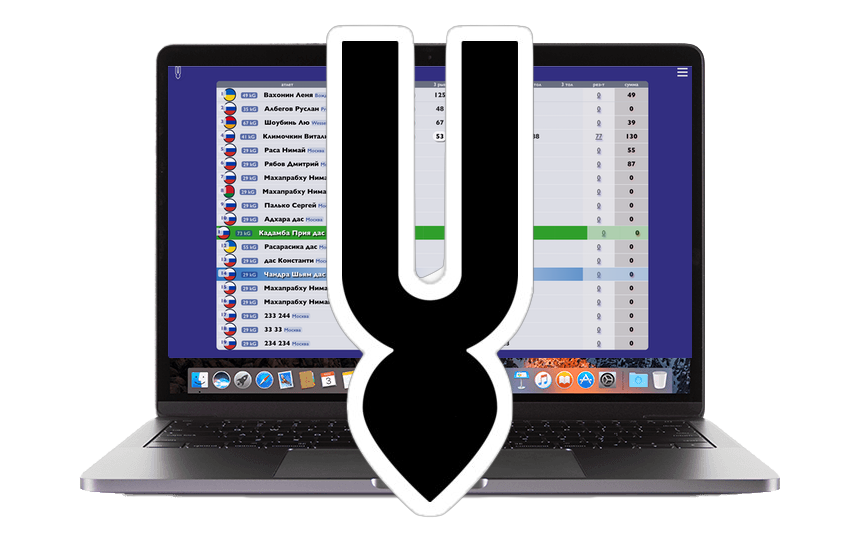

  

  
  
  

# v7pro
v7pro (спортивная система) - это программно-аппаратный комплекс систем, автоматизации ведения спортивных мероприятий - Олимпийского вида спорта Тяжелая атлетика (двоеборье) Программа двоеборья состоит из рывка и толчка. Алгоритм v7 - выбирает атлета с минимальным весом в рывке и приглашает на помост, затем в толчке.

## Languages and Tools:

&nbsp;
&nbsp;
&nbsp;
&nbsp;
&nbsp;
&nbsp;
&nbsp;
&nbsp;
&nbsp;

  

